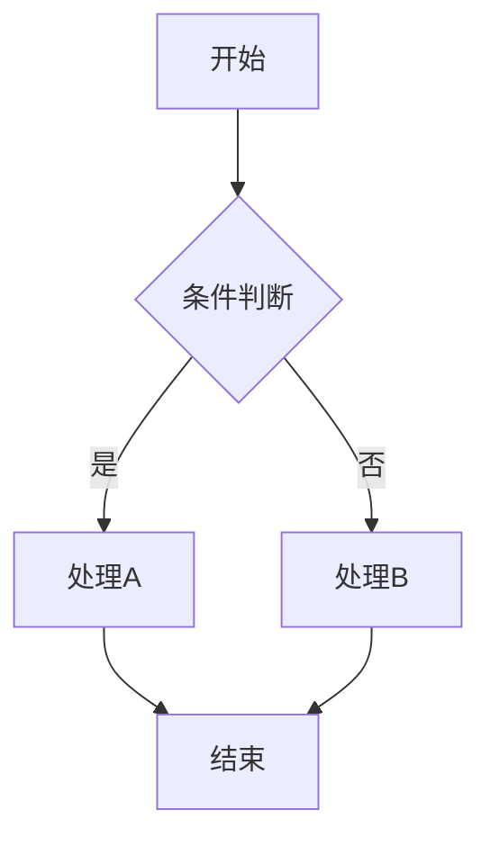
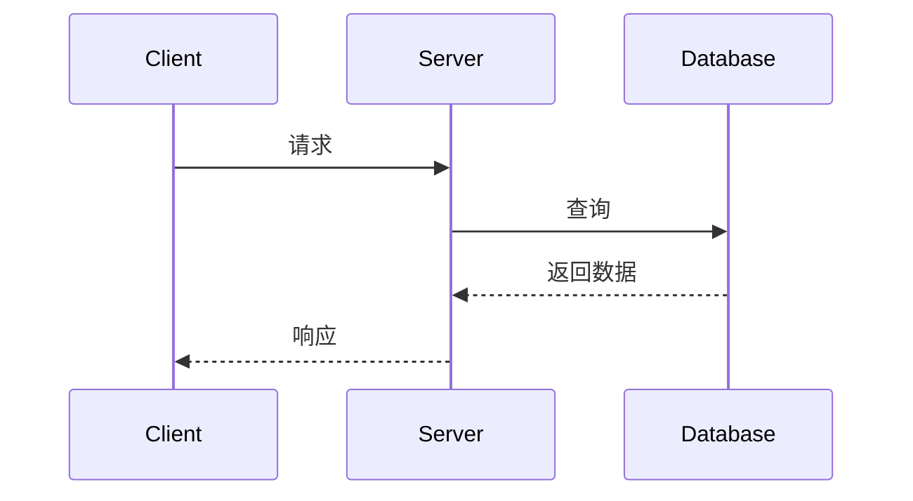
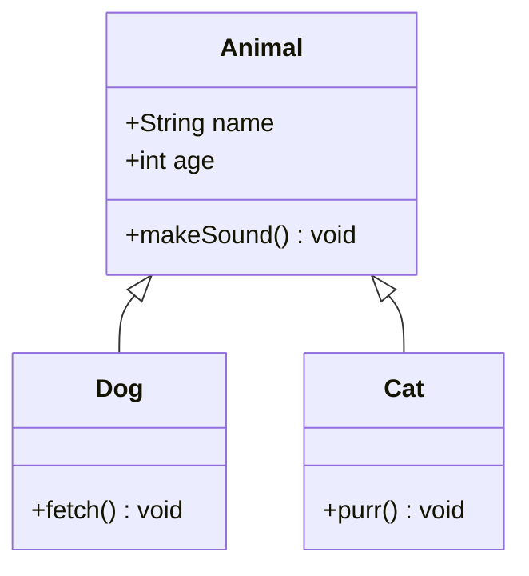
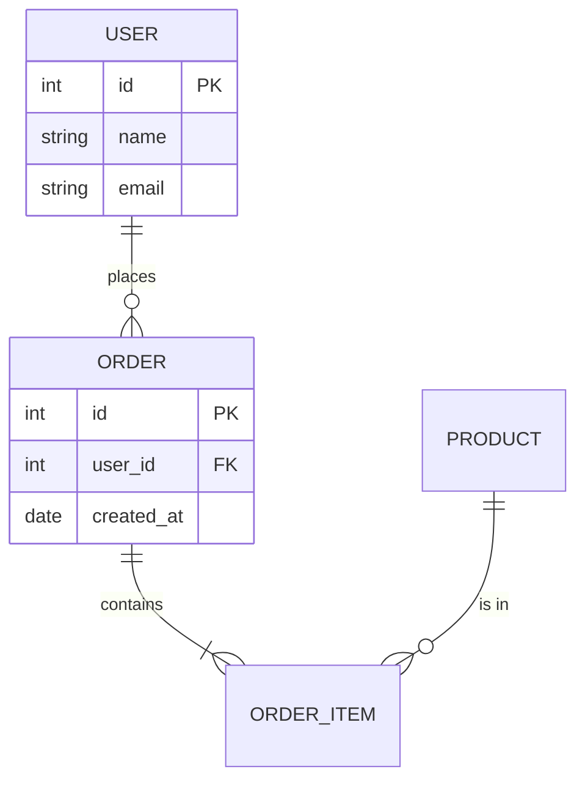
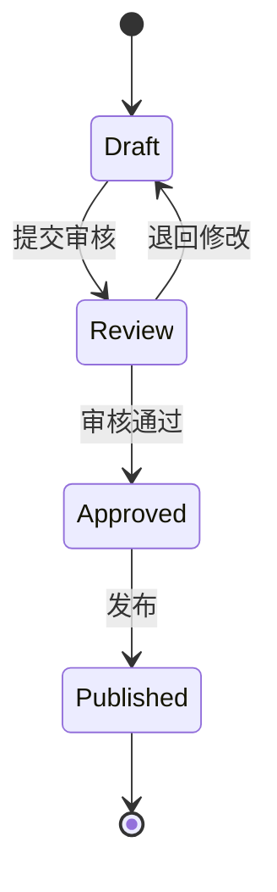
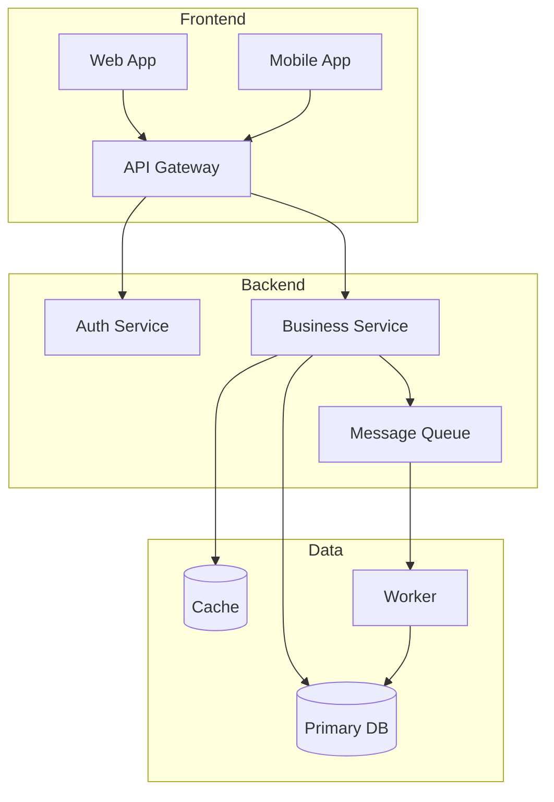

# draw.io Diagram Skill

通过 draw.io MCP server 创建技术图表。支持 Mermaid、CSV、XML 三种输入格式，提供智能格式判别、文件落盘、代码出图等工作流增值。

## 触发条件

- 显式调用: `/drawio <描述或参数>`
- 自然语言触发词: 画图、画个图、流程图、架构图、时序图、类图、ER图、状态图、diagram、drawio、mermaid

## 参数

```
/drawio [描述] [选项]

选项:
  --format mermaid|csv|xml    指定输入格式（默认: 自动判别）
  --type flowchart|sequence|class|er|state|architecture  图表类型（默认: 根据描述推断）
  --from-code <路径>          从代码文件/目录生成图表
  --open                      生成后自动在浏览器中打开（默认不打开）
  --dark                      使用深色主题
```

`$ARGUMENTS` 包含所有参数。`$1` 为第一个位置参数（通常是描述文本）。

## 工作流

### Step 1: 解析输入

从 `$ARGUMENTS` 中提取：
1. 描述文本（非 `--` 开头的部分）
2. 各选项参数值
3. 如果是 `--from-code`，记录目标路径

### Step 2: 智能格式判别

按优先级确定输入格式：

1. **用户显式指定** `--format` -> 直接使用
2. **检测已有内容**:
   - 用户提供了 Mermaid 语法（含 `graph`、`sequenceDiagram`、`classDiagram` 等关键词）-> Mermaid
   - 用户提供了 CSV 数据 -> CSV
   - 用户提供了 XML（含 `<mxGraphModel>` 或 `<diagram>`）-> XML
3. **默认路径** -> Mermaid（最通用、可读性最好）

### Step 3: 图表类型映射

当格式为 Mermaid 时，根据用户意图映射到 Mermaid 语法类型：

| 用户意图 | Mermaid 类型 | 关键词 |
|---------|-------------|--------|
| 流程图 | `flowchart TD` | 流程、flow、process、步骤 |
| 时序图 | `sequenceDiagram` | 时序、交互、sequence、调用链 |
| 类图 | `classDiagram` | 类、class、继承、接口 |
| ER图 | `erDiagram` | ER、实体、数据库、表关系 |
| 状态图 | `stateDiagram-v2` | 状态、state、生命周期、状态机 |
| 系统架构图 | `flowchart TD` + subgraph | 架构、architecture、系统、组件、部署 |

如果无法从描述中推断，默认使用 `flowchart TD`。

### Step 4: 生成图表内容

#### 4a. 普通模式（从描述生成）

根据用户描述，使用对应模板生成图表内容。遵循以下原则：
- 节点命名清晰、简洁
- 使用有意义的连接标签
- 合理利用子图（subgraph）组织结构
- 深色主题（`--dark`）: 在 Mermaid 中使用 `%%{init: {'theme': 'dark'}}%%`

#### 4b. 代码出图模式（`--from-code`）

1. 读取指定路径的文件或目录结构
2. 分析代码结构：
   - 类/接口及其继承关系 -> classDiagram
   - 模块/包依赖关系 -> flowchart
   - API 调用链 -> sequenceDiagram
   - 数据模型关系 -> erDiagram
3. 生成对应 Mermaid 图表
4. 在 Mermaid 源码中添加来源标注注释：

```mermaid
%% Generated from: src/main/java/com/example/
%% Scope: class hierarchy
classDiagram
    ...
```

**注意**: 代码出图为 V1 基础版，聚焦结构可视化。不尝试表达运行时行为或完整调用图。如果指定路径文件过多（>20个），优先选择核心文件并在注释中说明。

### Step 5: 文件落盘

源文件是一等公民，必须持久化保存。

#### 文件扩展名

| 格式 | 扩展名 |
|------|--------|
| Mermaid | `.mmd` |
| CSV | `.csv` |
| XML | `.drawio` |

#### 存放位置（按优先级）

1. 项目已有 `docs/diagrams/` 目录 -> 存放于此
2. 项目已有 `doc/diagrams/` 目录 -> 存放于此
3. 以上都不存在 -> 在当前工作目录创建 `docs/diagrams/` 并存放

#### 命名约定

- 全小写，单词用连字符分隔
- 从描述中提取核心语义作为文件名
- 示例: `user-login-flow.mmd`, `system-architecture.mmd`, `order-entity-relation.mmd`

#### 覆盖保护

如果目标文件已存在：
1. 提示用户文件已存在
2. 询问是覆盖还是使用新文件名
3. 不要静默覆盖

### Step 6: MCP 调用与降级

#### MCP 可用时

调用对应的 draw.io MCP 工具：

| 格式 | MCP 工具 | 参数 |
|------|---------|------|
| Mermaid | `open_drawio_mermaid` | `mermaid`: Mermaid 源码字符串 |
| CSV | `open_drawio_csv` | `csv`: CSV 数据字符串 |
| XML | `open_drawio_xml` | `xml`: draw.io XML 字符串 |

所有工具还支持可选参数：
- `dark` (boolean): 深色主题，当用户指定 `--dark` 时传入 `true`

#### MCP 不可用时（降级）

仅输出源文件，附带安装提示：

```
已生成源文件: docs/diagrams/xxx.mmd

提示: draw.io MCP server 未安装。安装后可直接在浏览器中预览:
  npx -y @drawio/mcp
或在 .mcp.json 中添加配置后重启 Claude Code。
```

### Step 7: 输出

默认输出内容：
1. 源文件路径
2. MCP 链接（如果 MCP 可用，工具会返回浏览器打开的 URL）
3. Mermaid 源码预览（用代码块展示，方便复制）

如果用户指定了 `--open`，在 MCP 调用后提示已在浏览器中打开。

## 内嵌模板

以下模板供生成时参考，根据实际需求调整节点和连接。

### 流程图 (Flowchart)



### 时序图 (Sequence Diagram)



### 类图 (Class Diagram)



### ER 图 (Entity Relationship)



### 状态图 (State Diagram)



### 系统架构图 (Architecture with Subgraphs)



## 与 json-canvas 的边界

| 维度 | drawio (本 skill) | json-canvas |
|------|-------------------|-------------|
| 定位 | 技术图表（流程图、架构图、UML等） | Obsidian 画布（知识管理、思维导图） |
| 格式 | Mermaid / CSV / XML | JSON Canvas (.canvas) |
| 渲染 | draw.io（浏览器） | Obsidian |
| 适用场景 | 代码文档、系统设计、技术方案 | 笔记组织、项目看板、研究画布 |

**路由规则**:
- 用户提到 drawio、Mermaid、UML、技术图表 -> 本 skill
- 用户提到 canvas、Obsidian、画布、知识图谱 -> json-canvas
- 模糊情况（如 "画个流程图"）-> 本 skill（技术图表更常见）

## 注意事项

- Mermaid 语法中的特殊字符（如引号、括号）需要正确转义
- 生成大型图表时注意可读性，适当使用子图分组
- CSV 格式适合表格型数据（如组织架构），Mermaid 适合逻辑关系
- XML 格式通常用于导入已有的 draw.io 文件，很少需要手写
